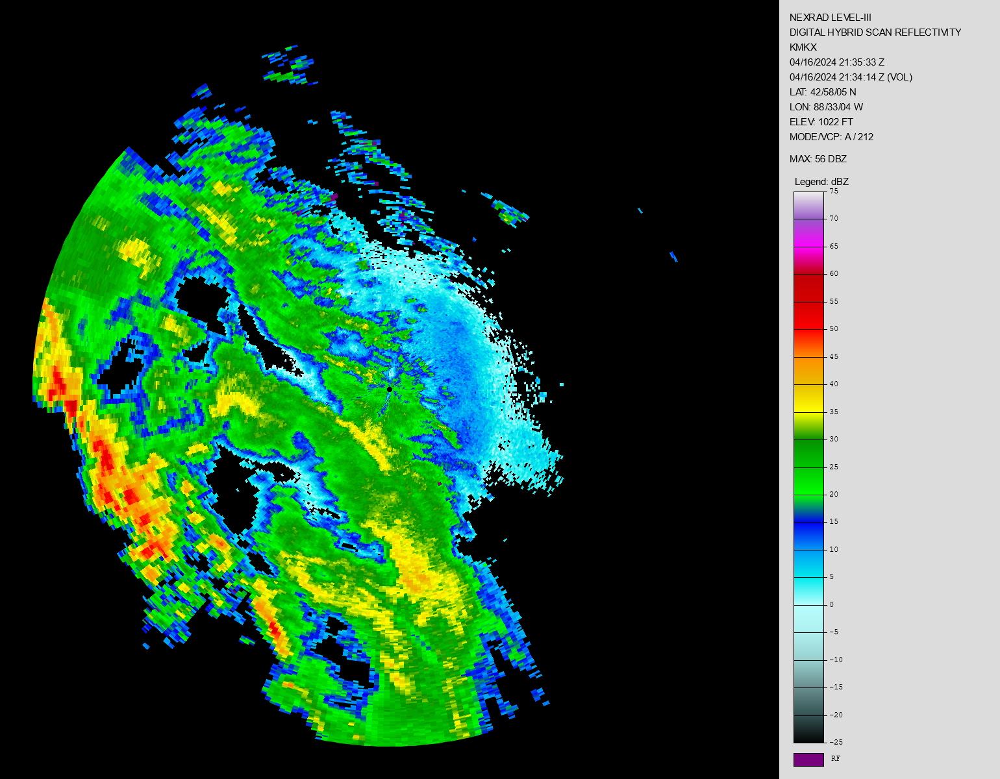

# radar

A Rust library (and rough plotter) for parsing [NEXRAD Level 3](https://www.ncei.noaa.gov/access/metadata/landing-page/bin/iso?id=gov.noaa.ncdc:C00708)
weather radar product files — the format WSR-88D radar sites use to
distribute processed products like base reflectivity, base velocity, and
precipitation accumulation.




## Architecture

```
.
├── src/
│   ├── lib.rs                     # crate docs, public re-exports, Radar struct + from_vec/parse
│   ├── error_r.rs                 # the crate's Error type
│   ├── codes.rs                   # MessageCode (product type) and PacketCode enums + color tables
│   ├── color_ramp.rs              # predefined colour ramps for digital data arrays
│   ├── level_scaling.rs           # raw data level -> physical value, per product
│   ├── text_header.rs             # WMO/AWIPS text header (first 30 bytes of every file)
│   ├── message_header.rs          # 18 byte Message Header Block
│   ├── product_description.rs     # 102 byte Product Description Block
│   ├── product_symbology/
│   │   ├── mod.rs                 # SymbologyBlock, SymPacketData, layer dispatch
│   │   ├── symbology_header.rs    # 16 byte symbology block header
│   │   ├── symbology_layer.rs     # per-layer packet-code dispatch
│   │   └── packet/
│   │       ├── util.rs                   # shared block-length / RLE helpers
│   │       ├── radial.rs                 # Radial Data packet (AF1F, run-length encoded)
│   │       ├── digital_radial.rs         # Digital Radial Data Array packet (code 16)
│   │       ├── text_and_special_symbol.rs # Text/Special Symbol packets (codes 1, 2, 8)
│   │       ├── vector.rs                 # linked/unlinked/contour vectors (6, 9, 7, 10, 0802, 0E03, 3501)
│   │       ├── raster.rs                 # raster + precip/raster arrays (BA0F, BA07, 17, 18, 33)
│   │       ├── wind.rs                   # vector arrows (5) and wind barbs (4)
│   │       ├── special_symbol.rs         # special graphic symbols (3, 11-15, 19, 20, 23-26)
│   │       ├── cell_trend.rs             # cell trend data + volume scan times (21, 22)
│   │       ├── map_message.rs            # map overlay packets (0E23, 4E00, 3521, 4E01)
│   │       ├── generic_data.rs           # Generic Data packet (28, 29) + Appendix E format
│   │       └── xdr.rs                    # minimal XDR reader (RFC 1832/4506)
│   ├── graphic_alphanumeric/mod.rs # Graphic Alphanumeric Block (ID 2)
│   ├── tabular_alphanumeric/mod.rs # Tabular Alphanumeric Block (ID 3)
│   ├── plot.rs                    # Radar::plot / plot_to / plot_with — PNG + annotation panel
│   └── table_v.rs                 # raw (non-compiled) reference notes, see the file's header
├── examples/
│   ├── inspect.rs                 # minimal library usage: parse a file, print a summary
│   └── parse.rs                   # parse a file, dump it to JSON, and plot it
├── tests/
│   ├── parse_sample_file.rs       # integration tests against the fixture in data/
│   ├── alphanumeric_blocks.rs     # graphic/tabular block offset wiring
│   ├── plot_geometry.rs           # asserts north-up/clockwise on rendered pixels
│   └── color_ramp_reference.rs    # checks the dBZ ramp against the reference legend
├── data/
│   ├── sn_DS.p20-r_kmkx.last      # base reflectivity (product 20), KMKX radar
│   ├── sn_DC.radar_DS.32dhr_KMKX.last  # digital hybrid scan reflectivity (product 32)
│   ├── sn_DC.radar_DS.32dhr_KMKX.png   # reference plot of that file, from other software
│   ├── sn_DC.radar_DS.56rm1_KMKX.last  # storm relative mean radial velocity (product 56)
│   └── sn_DC.radar_DS.p99v0_KMKX.last  # base velocity data array (product 99)
└── nexrad_level3.py                # vendored Py-ART reference (see Status)
```

A Level 3 file is a WMO/AWIPS text header followed by a binary Graphic
Product Message:

**Figure 3-6. Graphic Product Message (Page 3-21)**
| Data format | |
| -- | -- |
| MESSAGE HEADER BLOCK | (see Figure 3-3) |
| PRODUCT DESCRIPTION BLOCK (1) | (see Figure 3-6 Sheet 2, 6, 7) |
| PRODUCT SYMBOLOGY BLOCK (1) | (see Figure 3-6 Sheet 3, 8) |
| GRAPHIC ALPHANUMERIC BLOCK (1) | (see Figure 3-6 Sheet 4, 9) |
| TABULAR ALPHANUMERIC BLOCK (1) | (see Figure 3-6 Sheet 5, 10) |

(1) All blocks need not be used. Any blocks that are used must remain in the order shown above.

### Graphic Product Message

The RPG transmits products to the Class 1 User/RPGOP by using the Graphic Product message shown in Figure 3-6. The message consists of several blocks. Not all products require all blocks; however, the blocks are always transmitted in the order shown in Figure 3-6. One Header block and one Product Description block always precede the product. Products consist of one Product Symbology block (Block ID = 1), and zero or one of each of the Graphic Alphanumeric (Block ID = 2), and Tabular Alphanumeric blocks (Block ID = 3). The number of the last two blocks in each message used is product dependent.

### Product Description Block

The Product Description block for product data transmission is shown in **Figure 3-6 (sheets 2, 6, and 7)**. Refer to Table V for the definitions of these fields and their corresponding products.

As shown in **Figure 3-6 (sheet 2)**, halfwords 55-60 contain offsets from the beginning of the message header (halfword 1) to the (-1) divider of each block indicated. If a product being transmitted does not require a block, or the data is not available, the offset to the block in question is set to zero. The first offset (halfword 55-56) is the offset to the Product Symbology block. The second offset (halfword 57-58) is the offset to the (-1) divider of the Graphic Alphanumeric block (Block ID = 2). The third offset is the offset to the Tabular Alphanumeric block (Block ID = 3).

### Product Symbology Block

The Product Symbology block is block ID number 1 and is shown in **Figure 3-6 (sheets 3 and 8)**. It is always numbered as 1. If it is available in a product, it will always follow the Product Description block. In general, this block contains display data packets that make up the geographic display of the product. These packets contain vectors, text and special character symbols, map data, radial data, raster data, precipitation data, vector arrow data, wind barb data, and special graphic symbols. The packet formats are defined in **Figures 3-7 through 3-15c**. The Symbology block may, depending upon the product, have multiple "layers" of packets.

### Graphic Alphanumeric Block

The Graphic Alphanumeric block is block ID number 2. It is the block in which display packets are
defined to cause the storm related data to be displayed at the top of the geographic screen to amplify
the corresponding graphic displayed symbology. The format of this block is shown graphically in
Figure 3-6 (sheets 4 and9). The only products for which this block is formatted are the following:

| Product Code | Product Name |
| -- | -- |
| 31 | User Selectable Precipitation |
| 37-38, 97-98 | Composite Reflectivity, Composite Reflectivity Edited for AP |
| 58 | Storm Tracking Information |
| 59 | Hail Index |
| 61 | Tornado Vortex Signature |
| 141 | Mesocyclone Detection |
| 143 | Tornado Vortex Signature Rapid Update |

The actual data within this block is a series of text packets that format the line data into 5 lines. The number of pages is data dependent. The text packet format used for the attributes is packet number 8 shown in Figure 3-8. Notice that I-start and J-start are defined as 1/4 km from the radar. The Graphic Attributes packets are not geographic, but are actual screen coordinates. Included in the text packet for each page of Attribute data is a series of vector packets to draw the grid lines. The vector packets used are shown in Figure 3-7. The product dependent data identified in Table VII is incorporated into the Graphic Alphanumeric Block.

### Tabular Alphanumeric Block

The Tabular Alphanumeric block for product data transmission is Block ID number 3. The format of this block is shown graphically in Figure 3-6 (sheets 5 and 10). It is always numbered 3 even though it may not be the third block in the product. The following products have a paired-alphanumeric product that is encoded as Block 3 (Figure 3-6, sheet 7). The paired-alphanumeric product has a second Header and Product Description block as shown in the figure. The products that have Block ID 3 are as follows:

| Product Code | Product Name | Block 3 Message Code |
| -- | -- | -- |
| 48 | VAD Wind Profile | 100 |
| 58 | Storm Tracking Information | 101 |
| 59 | Hail Index | 102 |
| 61 | Tornado Vortex Signature | 104 |
| 78 | Surface Rainfall Accumulation (1 hour) | 107 |
| 79 | Surface Rainfall Accumulation (3 hours) | 108 |
| 80 | Storm Total Rainfall Accumulation | 109 |
| 132 | Clutter Likelihood Reflectivity | 110 |
| 133 | Clutter Likelihood Doppler | 111 |
| 141 | Mesocyclone Detection | 141 |
| 143 | Tornado Vortex Signature Rapid Update | 143 |
| 172 | Digital Storm Total Accumulation | 172 |

The second header of the alphanumeric product is exactly the same as the header at the beginning of the message, except that the Message Code is as defined above. The Data portion of the alphanumeric product is ASCII text formatted into pages of 17 lines of 80-character data. Each page is separated by the (-1) divider. Alphanumeric products containing this block have it as the last block of the product message. The product dependent data identified in Table VIII is incorporated into the Tabular Alphanumeric Block.

## Usage

### As a library

This reads the real fixture bundled in [`data/`](data/sn_DS.p20-r_kmkx.last)
— a base reflectivity product from the KMKX (Milwaukee, WI) radar:

```rust
let bytes = std::fs::read("data/sn_DS.p20-r_kmkx.last")?;
let (leftover, radar) = radar::Radar::from_vec(bytes)?;

println!("{} — {:?}", radar.text_header.location, radar.message_header.code);
println!("issued {}", radar.message_header.datetime);

if let Some(symbology) = &radar.symbology {
    println!("{} symbology layer(s)", symbology.layers.len());
}

radar.plot()?; // writes image.png
```

which prints:

```text
KMKX — BaseReflectivity20
issued 2022-09-09 12:55:14 UTC
1 symbology layer(s)
```

`Radar::from_vec` never panics — malformed, truncated, or not-yet-supported
input returns an `Err` (see [Status](#status)).

#### Reading symbology packets

Each symbology layer is a [`SymPacketData`](src/product_symbology/mod.rs)
variant naming the packet code it came from, so matching on it gets you the
decoded packet:

```rust
use radar::SymPacketData;

for layer in radar.symbology.iter().flat_map(|s| &s.layers) {
    match layer {
        // Run-length encoded radial data (packet code AF1F)
        SymPacketData::RadialDataAF1F(p) => {
            for radial in &p.radials {
                let azimuth = radial.header.angle_start as f32 / 10.0; // 0.1 deg units
                let bins: u32 = radial.data.iter().map(|r| r.run as u32).sum();
                println!("{azimuth:.1} deg, {bins} bins");
            }
        }
        // 8-bit data levels per radial (packet code 16)
        SymPacketData::DigitalRadialDataArray(p) => {
            println!("{} radials of 8-bit levels", p.radials.len());
        }
        SymPacketData::WindBarbData(p) => {
            for barb in &p.barbs {
                println!("{} kt at {} deg", barb.speed, barb.direction);
            }
        }
        SymPacketData::CellTrendData(p) => {
            for trend in &p.trends {
                println!("cell {} {:?} in {}", p.cell_id, trend.trend_code, trend.trend_code.units());
            }
        }
        other => println!("{other:?}"),
    }
}
```

#### The alphanumeric blocks

```rust
// Storm attribute tables drawn at the top of the display (Block ID 2)
for page in radar.graphic.iter().flat_map(|g| &g.pages) {
    println!("graphic page {}: {} packet(s)", page.page_number, page.packets.len());
}

// Paged 80-column text (Block ID 3)
for page in radar.tabular.iter().flat_map(|t| &t.pages) {
    for line in &page.lines {
        println!("{line}");
    }
}
```

#### Color tables

`color_code` always returns a color, falling back to gray. Use
`color_table` when you need to know whether the Product Specification
actually defines one for a product:

```rust
let code = radar.message_header.code;
match code.color_table() {
    Some(table) => {
        println!("{:?} defines {} data levels", code, table.len());
        for level in table.level_codes() {
            println!("  {level} -> {:?}", table.color(level));
        }
    }
    None => println!("{code:?} has no table in the spec"),
}
```

#### Plotting

`plot()` writes `image.png` with default settings. `plot_with` takes
[`PlotOptions`](src/plot.rs) for control over the ramp, the site label, the
image size, and whether the annotation panel is drawn at all:

```rust
use radar::{ColorRamp, PlotOptions};

// Defaults: ramp chosen from the product's units, panel shown, 1200 px.
radar.plot_to("auto.png")?;

// Explicit ramp and site label. The file carries only the station
// identifier, so a place name has to be supplied if you want one.
radar.plot_with(
    "reflectivity.png",
    &PlotOptions::new()
        .with_ramp(ColorRamp::NwsReflectivity)
        .with_site_label("KMKX - MILWAUKEE, WI"),
)?;

// Just the radar image, no annotation panel.
radar.plot_with("bare.png", &PlotOptions::new().without_panel().with_image_size(800))?;
```

#### Decoded values

Where the product's threshold format is known, raw levels decode to physical
values:

```rust
if let Some(scaling) = radar.product_description.level_scaling() {
    println!("levels decode to {}", scaling.units);
    // Levels below `first_data_level` are flags, not measurements.
    for level in [0u8, 1, 64, 176] {
        match scaling.value(level) {
            Some(v) if scaling.is_range_folded(level) => println!("{level}: range folded ({v})"),
            Some(v) => println!("{level}: {v} {}", scaling.units),
            None if scaling.is_range_folded(level) => println!("{level}: range folded"),
            None => println!("{level}: below threshold"),
        }
    }
}
```

### Examples

#### Example 1:

Both examples default to the same bundled fixture when run with no
arguments; pass a path to parse a different file instead.

```sh
cargo run --example inspect
```

prints a short summary (no file output) — this is real output from the
bundled fixture:

```text
Station:      KMKX
Product:      N0Z (BaseReflectivity20)
Issued:       2022-09-09 12:55:14 UTC
Radar site:   42.968, -88.551 (1022 ft)
VCP:          35
Symbology:    1 layer(s)
  layer 0: 360 radials x 230 bins (run-length encoded)
```

#### Example 2:

```sh
cargo run --example parse -- data/sn_DC.radar_DS.56rm1_KMKX.last
```

parses the file, dumps it (and any leftover bytes) to `out.json` /
`out_leftover.json`, plots it to `image.png`, and logs each step.

#### Example 3:

```sh
cargo run --example parse -- data/sn_DS.p20-r_kmkx.last
```

parses the file, dumps it (and any leftover bytes) to `out.json` /
`out_leftover.json`, plots it to `image.png`, and logs each step

The gray-fallback warning is expected for this fixture, and is not a missing
feature: revision AE of the Product Specification defines no colour table for
the legacy 16-level Base Reflectivity products (19/20), having superseded
them with the 256-level digital products. Set `RUST_LOG=debug` (or `trace`)
for more verbose parser logging, e.g.
`RUST_LOG=debug cargo run --example parse -- <file>`.

#### Example 4: choosing a colour ramp

The digital hybrid scan reflectivity fixture has a reference plot beside it in
`data/`, so it is the one to compare against:

```sh
cargo run --example parse -- data/sn_DC.radar_DS.32dhr_KMKX.last \
    --site "KMKX - MILWAUKEE, WI"
```

With no `--ramp` the product's dBZ units select `nws-reflectivity`, and the
annotation panel comes out as:

```text
NEXRAD LEVEL-III
DIGITAL HYBRID SCAN REFLECTIVITY
KMKX - MILWAUKEE, WI
04/16/2024 21:35:33 Z
04/16/2024 21:34:14 Z (VOL)
LAT: 42/58/05 N
LON: 88/33/04 W
ELEV: 1022 FT
MODE/VCP: A / 212

MAX: 56 DBZ
```

followed by a dBZ colour bar from +75 down to -25 and a range-folded swatch.
Every one of those lines comes out of the file: the timestamps from the product
and volume scan date/time halfwords, the position from halfwords 11-15, the
mode and VCP from halfwords 17-18, and `MAX` from the product-dependent
halfword 47 that Table V defines as maximum reflectivity for this product.

Override the ramp to see the raw levels instead:

```sh
cargo run --example parse -- data/sn_DC.radar_DS.32dhr_KMKX.last --ramp grayscale
```

`--ramp` accepts `hue`, `grayscale`, or `nws-reflectivity`; run the example
with no arguments to list them.

### How the plot is coloured

Which colouring rule applies depends on the *packet type*, because the two
kinds of data level mean different things:

| Packet | Levels | Coloured by |
| -- | -- | -- |
| Radial Data (`AF1F`, Figure 3-10) | 4-bit | the Product Specification table for the product, or [`FALLBACK_GRAY`](src/codes.rs) when it defines none |
| Digital Radial Data Array (code 16, Figure 3-11c) | 8-bit | a [`ColorRamp`](src/color_ramp.rs) |

A digital array's 8-bit levels are *not* table indices, so a 16-entry table
cannot be indexed by them. Instead:

- Where the product's threshold format is known, the level is decoded to a
  physical value and passed to a ramp whose domain is in those units — so
  product 32 is coloured by actual dBZ.
- Where it is not, or where the chosen ramp has no units, the raw level is
  passed to the ramp directly.
- Level 0 (below threshold) is left unpainted, showing the black background
  rather than a colour, and the "range folded" level gets its own dark purple.

The consequence worth knowing is that **a digital product renders in colour
even when the specification defines no table for it**. Both paths are pinned by
tests in [`tests/plot_geometry.rs`](tests/plot_geometry.rs).

#### Predefined ramps

| Name | Domain | Notes |
| -- | -- | -- |
| `hue` | raw level 0-255 | a sweep around the hue wheel; the fallback when units are unknown |
| `grayscale` | raw level 0-255 | linear black to white |
| `nws-reflectivity` | -25 to +75 dBZ | the NWS reflectivity ramp, recovered from `data/sn_DC.radar_DS.32dhr_KMKX.png` |

Leave the ramp unset and one is chosen from the product's units — dBZ products
get `nws-reflectivity`, everything else `hue`. Asking for a ramp whose units
the product cannot supply logs a warning and falls back rather than plotting,
say, knots against a dBZ scale.

`nws-reflectivity` was not hand-picked. The reference plot's legend draws
twenty 5 dBZ bands, each a linear gradient rather than a flat swatch; each band
was fitted down its centre column and extrapolated to its edges, and the two
estimates meeting at each boundary averaged. Re-evaluating the resulting 21
stops against every gradient pixel of that legend gives a mean error of
2.8/255, which [`tests/color_ramp_reference.rs`](tests/color_ramp_reference.rs)
re-checks against the image on every run.

## Testing

```sh
cargo test              # unit tests throughout src/, plus the tests/ suites
cargo clippy --all-targets
```

Unit tests live alongside the parser they test (`#[cfg(test)] mod tests`
in each file) and cover both real fixture data
(`data/sn_DS.p20-r_kmkx.last`, via `include_bytes!`) and small hand-built
byte buffers for edge cases — truncated input, unrecognized product/packet
codes, non-UTF-8 text fields, negative lengths, and the like. Each packet
parser is tested against a byte buffer built to its ICD figure.

The integration suites cover behaviour that spans modules:

- `tests/parse_sample_file.rs` — the bundled fixture end to end through the
  public `Radar::from_vec` API.
- `tests/alphanumeric_blocks.rs` — that the graphic and tabular blocks are
  found at the halfword offsets the product description gives.
- `tests/plot_geometry.rs` — that rendered pixels land where the ICD's
  north-up/clockwise azimuth convention requires.

Note: `radar.plot()` always writes to `image.png` in the current
directory (see [`src/plot.rs`](src/plot.rs)) — running either example will
overwrite that file. Use `radar.plot_to(path)` to write elsewhere; the
tests do this so they don't clobber it.

## Spec Documents

The parsers in this crate are implemented and verified against these two
documents (Build 24.0, 19 August 2025):

[Interface Control Document Class 1 User — 2620001AD](https://www.roc.noaa.gov/public-documents/icds/2620001AD.pdf)
— block and packet binary layouts (Figures 3-3 through 3-15c, and Appendix E).

[Interface Control Document Product Specification — 2620003AE](https://www.roc.noaa.gov/public-documents/icds/2620003AE.pdf)
— per-product data levels and color tables.

Where a parser encodes a specific field layout or scaling rule, the source
comment cites the figure it came from. See
[Spec conformance](#spec-conformance) for what has been checked.

## Spec conformance

Every extraction routine has been checked field-by-field against the ICD
revisions linked below. What was verified:

| Routine | Spec reference | Status |
| -- | -- | -- |
| [`text_header`](src/text_header.rs) | `SDUSXX KYYYY DDHHMM\r\r\nAAABBB\r\r\n`, 30 bytes | ✅ order, widths, total length |
| [`message_header`](src/message_header.rs) | Figure 3-3, 9 halfwords / 18 bytes | ✅ all 9 fields and types |
| [`product_description`](src/product_description.rs) | Figure 3-6 sheets 1-2, halfwords 10-60 / 102 bytes | ✅ all 23 fields, offsets, total length |
| [`symbology_header`](src/product_symbology/symbology_header.rs) + [`symbology_layer`](src/product_symbology/symbology_layer.rs) | Figure 3-6 sheet 2 | ✅ divider, block id, lengths, layer count |
| [`radial_data_af1f`](src/product_symbology/packet/radial.rs) | Figure 3-10, packet code `AF1F` | ✅ header fields, RLE nibble order (run = high, level = low), halfword sizing, 0.1° angle scaling |
| [`digital_radial_data_array`](src/product_symbology/packet/digital_radial.rs) | Figure 3-11c, packet code 16 | ✅ header fields, per-radial byte count incl. Note 1 halfword padding |
| [`vector`](src/product_symbology/packet/vector.rs) | Figures 3-7, 3-8, 3-8a | ✅ codes 6/9/7/10 and `0802`/`0E03`/`3501`; value-prefix only on 9 and 10 |
| [`raster`](src/product_symbology/packet/raster.rs) | Figures 3-11, 3-11a, 3-11b, 3-11d | ✅ codes `BA0F`/`BA07`/17/18/33; note 17 uses byte-wide runs while 18 uses nibbles |
| [`wind`](src/product_symbology/packet/wind.rs) | Figures 3-12, 3-13 | ✅ codes 5 and 4, five halfwords per record |
| [`special_symbol`](src/product_symbology/packet/special_symbol.rs) | Figure 3-14 | ✅ per-code record shapes for 3/11, 12-14/26, 15, 19, 20, 25; 23/24 nested packets retained |
| [`cell_trend`](src/product_symbology/packet/cell_trend.rs) | Figures 3-15, 3-15a | ✅ codes 21 and 22, trend codes 1-8 and their units |
| [`generic_data`](src/product_symbology/packet/generic_data.rs) + [`xdr`](src/product_symbology/packet/xdr.rs) | Figure 3-15c, Appendix E (E-1 to E-4, E-8, E-11) | ✅ split-halfword length, XDR primitives and padding, product description, radial and text components |
| [`graphic_alphanumeric`](src/graphic_alphanumeric/mod.rs) | Figure 3-6 sheets 4 and 9 | ✅ block header, pages, per-page text packets |
| [`tabular_alphanumeric`](src/tabular_alphanumeric/mod.rs) | Figure 3-6 sheets 5 and 10 | ✅ block header, repeated second header + product description, pages terminated by the -1 flag |
| Block offsets in [`Radar::parse`](src/lib.rs) | Figure 3-6 sheet 2, halfwords 55-60 | ✅ halfword-from-message-header arithmetic, asserted in [`tests/alphanumeric_blocks.rs`](tests/alphanumeric_blocks.rs) |
| [`color_table`](src/codes.rs) | Product Spec §3, §8, §12, §16, §17, §23, §28, §29, §40, §42, §43, §52, §53, §68 | ✅ all 14 tables (22 message codes), every level's RGB |
| [`level_scaling`](src/level_scaling.rs) | Note 1 of Figure 3-6 and Table V, cross-checked against Py-ART | ✅ all four documented encodings; verified against the real product 20 and 56 tables |
| [`map_message`](src/product_symbology/packet/map_message.rs) | Figure 3-9 sheets 2 and 3 | ✅ all four codes; 1/8 km upper-left-origin coordinates noted |
| Appendix E components | Figures E-1b, E-5 to E-12 | ⚠️ layouts implemented from the figures, but no file containing Grid/Area/Table/Event was available to validate against |
| [`plot_to`](src/plot.rs) geometry | Figure 3-10 ("Scan is always in Clockwise direction") | ✅ north-up, clockwise — asserted on rendered pixels in [`tests/plot_geometry.rs`](tests/plot_geometry.rs) |
| [`ColorRamp::NwsReflectivity`](src/color_ramp.rs) | the reference plot legend in `data/` | ✅ mean 2.8/255 against every legend pixel, re-checked in [`tests/color_ramp_reference.rs`](tests/color_ramp_reference.rs) |
| Annotation panel | Table V halfword 47, Figure 3-6 halfwords 11-18 | ✅ matches the reference plot line for line |

Known deviations, all intentional and documented in-source:

- `plot_to` renders range as a fraction of the image radius. The packet's
  range scale factor and index-of-first-range-bin are parsed and exposed but
  not applied, so the plot is not to a geographic scale.
- Data level thresholds (halfwords 31-46) are exposed as raw bytes; they are
  not decoded into physical units (dBZ, knots, inches). `plot_to` colors by
  raw level code rather than by decoded value — see
  [How the plot is coloured](#how-the-plot-is-coloured) for what that means
  for each packet type.
- The legacy 16-level Base Reflectivity products (19/20) have no color table
  in revision AE of the Product Specification — it defines levels only for
  the 256-level digital products that superseded them. Because those products
  arrive as `AF1F` packets, they render with the neutral gray fallback, which
  is why the bundled sample's PNG is a uniform gray disc.
- Clutter Likelihood Reflectivity (§36) defines a colour only for level 0;
  levels 1 to A are "TBD" in the document, so no table is transcribed for it.
- VIL level 3 is transcribed as `FA AA AA` because that is what §17.2.2
  prints, even though the otherwise identical table in §40.2.2 gives
  `FF AA AA` for the same "light pink". The discrepancy is in the document;
  both are recorded as printed and pinned by a test.
- The graphic and tabular alphanumeric blocks are parsed on a **best-effort**
  basis: a block that cannot be located or decoded is logged and left as
  `None` rather than failing the whole product. No fixture containing either
  block was available, so while their layouts were transcribed from the ICD
  and are covered by synthetic tests, they have not been validated against a
  real file.

Three caveats on the verification itself. The field-by-field checks were made
against the PDFs' extracted text layer, and a few tables in it are graphics
with no extractable text (§1.2.2's reflectivity table among them) — those could
not be checked either way. Of the packet parsers, only `AF1F` and packet code
16 are exercised by real files; the rest are verified against the ICD figures
and synthetic byte buffers. And the Appendix E Grid, Area, Table and Event
components are the weakest link: no file containing one was available and
Py-ART does not implement them either, so their field order comes from the
figures alone. Two guards make a misreading visible rather than silent —
decoding stops at any component type Appendix E does not define, and the
decoder logs when a payload was not fully consumed, which is what a wrong
layout looks like.

The threshold decoding, by contrast, is corroborated by real data: product 20
decodes to ND followed by -28 to +28 dBZ in 4 dBZ steps, and product 56 to ND,
-80 to +80 kt and RF at level 15 — the classic tables for both, with the
range-folded level derived from the flags rather than assumed.

## Status

**Implemented and tested:**
- The WMO/AWIPS text header, the binary Message Header Block, and the
  Product Description Block ([`text_header`](src/text_header.rs),
  [`message_header`](src/message_header.rs),
  [`product_description`](src/product_description.rs)) for the 33 product
  codes listed in `MessageCode::is_supported_product` (base reflectivity,
  base velocity, spectrum width, precipitation accumulation products, VIL,
  echo tops, hydrometeor classification, and others — see
  [`src/codes.rs`](src/codes.rs)).
- The Product Symbology Block header and layer dispatch
  ([`product_symbology`](src/product_symbology/mod.rs)).
- **Every symbology display data packet** defined in Figures 3-7 through
  3-15c, plus the Map Message packets of Figure 3-9
  (see [`src/product_symbology/packet/`](src/product_symbology/packet/)):
  radial data (`AF1F` and code 16), text and special symbols (1, 2, 8),
  linked and unlinked vectors (6, 9, 7, 10), contour vectors (`0802`,
  `0E03`, `3501`), raster data (`BA0F`, `BA07`), the digital precipitation,
  precipitation rate, and digital raster arrays (17, 18, 33), vector arrows
  (5), wind barbs (4), all the special graphic symbols (3, 11-15, 19, 20,
  23-26), cell trends (21, 22), and the XDR-encoded Generic Data packet
  (28, 29) including its Appendix E Generic Product Format payload — all six
  component types, both leading descriptions, and the map overlay geometry of
  the map products (`0E23`, `4E00`, `3521`, `4E01`) in their 1/8 km
  upper-left-origin coordinates.
- **The Graphic Alphanumeric Block** (Block ID 2) and **Tabular
  Alphanumeric Block** (Block ID 3) —
  [`graphic_alphanumeric`](src/graphic_alphanumeric/mod.rs) and
  [`tabular_alphanumeric`](src/tabular_alphanumeric/mod.rs). Both are
  located from their halfword offsets in the product description and
  decoded: the graphic block into pages of text packets, the tabular block
  into its repeated second header/product description plus pages of
  80-character lines.
- **Per-product color tables** — all 14 the Product Specification defines,
  covering 22 message codes (`MessageCode::color_table` in
  [`src/codes.rs`](src/codes.rs)).
- BZ2-decompression of the symbology block, when present.
- **Decoding raw data levels into physical values**
  (`ProductDescription::level_scaling` in
  [`src/level_scaling.rs`](src/level_scaling.rs)), covering all four encodings
  Note 1 of Figure 3-6 defines: the packed flag/value threshold halfwords of
  the 8- and 16-level products (including their categorical codes such as ND
  and RF, the 100/20/10 scale bits and the `> < + -` qualifiers), the signed
  tenths/hundredths and IEEE float scale-and-offset families, product 134's
  modified 16-bit floats with a linear-then-logarithmic relation, and product
  135's packed altitude plus "topped" flag.
- A plotter (`Radar::plot` / `plot_to` / `plot_with`) that renders the first
  symbology layer to a PNG with an annotation panel and a colour bar legend,
  and a set of predefined colour ramps
  ([`ColorRamp`](src/color_ramp.rs)) for digital data arrays — including the
  NWS reflectivity ramp recovered from the reference plot in `data/`.

**Deliberately out of scope:**
- The Map Message *message* format itself (halfwords 61 onwards of Figure 3-9
  sheet 1 — map ID, data piece directory and byte counts). The four map
  overlay *packets* are parsed; the surrounding message that carries map file
  pieces is a different message type, not a symbology block, and no supported
  product contains one.
- `level_scaling` returns `None` for the products Note 1 excludes from every
  documented encoding: 81, 93, 153-155 and 189-195, plus 177, whose levels are
  classification indices carrying no scaling. Guessing a format for these
  would be worse than reporting that none is known.
- Geographic projection. The plot draws range as a fraction of the image
  radius with no map overlay, so it will not register against a georeferenced
  reference plot.

Malformed, truncated, or not-yet-supported input always returns an
[`Error`](src/error_r.rs) rather than panicking.

`nexrad_level3.py`, a vendored copy of
[Py-ART's](https://github.com/ARM-DOE/pyart) Level 3 reader, is kept as a
cross-check on the binary layouts and on the places where the ICD's stated
types disagree with what real products contain. It is not part of the Rust
crate and isn't built, run, or tested by anything here — and it isn't
runnable as-is in this repo anyway, since it imports `mda_xdrlib`, which
isn't vendored alongside it.

It is no longer the more complete implementation of the two: it handles
three packet codes (16, `AF1F` and 28) against this crate's full set, and
states that support for the products without a Radial Image message format
— the raster and alphanumeric ones — is not planned.

## Links

[RADAR PRODUCTS AVAILABLE FROM RPCCDS](https://www.weather.gov/media/tg/rpccds_radar_products.pdf)

[Satellite Product File Folder Structure](https://www.weather.gov/tg/satfiles)

[Radar Product File Folder Structure](https://www.weather.gov/tg/radfiles)

[NWS WSR-88D Level III Radar](https://www.roc.noaa.gov/WSR88D/Level_III/Level3Info.aspx)

Temperature - SL.us008001_ST.opnl_DF.gr2_DC.ndfd_AR.conus_VP.001-003_ds.temp

## Number formats

| | |
| --- | --- |
| Byte/Char   | One byte (8 bits) |
| INT*2       | 2 byte, signed integer data |
| INT*4       | 4 byte, signed integer data |
| UINT*4      | 4 byte, unsigned integer data |
| REAL*4      | 4 byte, floating point data adhering to IEEE-754-1985 standard |
| String      | NULL (0) terminated array of ASCII coded characters, each character occupying 1 byte  |
| Pointer     | Contains the address of a data item. Size is architecture dependent. |
| HALFWORD    | two bytes |

This is on page 3-27:
```python
def _int16_to_float16(val):
    """Convert a 16 bit interger into a 16 bit float."""
    # NEXRAD Level III float16 format defined on page 3-33.
    # Differs from IEEE 768-2008 format so np.float16 cannot be used.
    sign = (val & 0b1000000000000000) / 0b1000000000000000
    exponent = (val & 0b0111110000000000) / 0b0000010000000000
    fraction = val & 0b0000001111111111
    if exponent == 0:
        return (-1) ** sign * 2 * (0 + (fraction / 2**10.0))
    else:
        return (-1) ** sign * 2 ** (exponent - 16) * (1 + fraction / 2**10.0)
```
